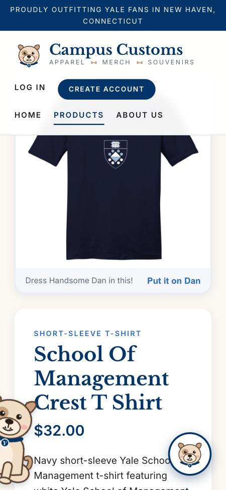

# Usability improvements

Improvements made to the Campus Customs website and shop chatbot in Problem 9: what was added, and how each one helps a shopper or the business.

## Front end

### Handsome Dan and his pile of dog bones

**What I added:** a playful corner in the bottom left of every page, drawn in SVG (`frontend/src/components/DanCorner.tsx`, `SittingDan.tsx`, `DogBones.tsx`): Handsome Dan sitting on the left with a pile of five cartoon bones in front of him to his right. The top-left bone wears a Yale-blue "Y" tag.
- **Clickable bones:** each click makes a bone wiggle; on the 5th click the Y bone wiggles last, then Dan grabs it in his mouth and wags his tail for a few seconds before putting it back.
- **Dress up Dan:** on any product page, "Put it on Dan" dresses him in that product (a bowtie replaces his collar for the School of Management shirt).
- **Stays out of the way:** the corner rises so it never covers the blue footer, and on small screens it changes layout (see **Responsive design** below).

**How it helps:** it adds to the friendly Handsome Dan theme (bulldog mascot, chat assistant "Dan", party banner) and gives shoppers small moments of delight, which makes the store feel warm and memorable and helps the brand stand out from generic online shops. Dressing Dan in a product is also a fun way to picture an item and spend a little more time with it.

### Create Account form fix

**What I added:** the First Name and Last Name boxes sit side by side, and the Last Name box used to spill past the edge of the form. The labels and inputs are now allowed to shrink to share the row (`min-width: 0; width: 100%`), so both fit inside the card. On narrow screens they still stack.

**How it helps:** a broken-looking sign-up form makes shoppers hesitate or give up. A clean form makes creating an account feel trustworthy and easy, which means more shoppers sign up and get saved chat history.

### Add to Cart button with confetti

**What I added:** an **Add to Cart** button on every product page (`frontend/src/components/AddToCartButton.tsx`). Clicking it bursts colorful confetti in Yale blue, tan, and pink and briefly changes the label to "Added! 🎉". Each click makes a new burst. If the product is sold out in every size, the button reads "Sold Out" and is disabled. There is no real cart yet; this is the celebration only. Confetti is skipped for people whose system is set to reduce motion.

**How it helps:** shoppers expect an Add to Cart button on a product page, and its absence made the page feel unfinished. The confetti gives clear, cheerful feedback that the click worked. For the business, it puts the main call to action in place, ready to connect to a real cart and checkout.

### Chat message box that grows with the text

**What I added:** the chat's one-line input is now a text box that grows as the shopper types, so the whole message stays visible. It stops growing at **140 px** (about 6 lines) and scrolls after that, so it never covers the conversation. **Enter** sends; **Shift+Enter** adds a new line. It shrinks back after sending.

**How it helps:** shoppers often describe what they want in detail ("a gift for my dad who loves baseball, size large, navy or gray"). Seeing the full message lets them check it before sending, which leads to better questions and better answers from Dan.

### Suggested starter questions

**What I added:** when the chat opens with nothing asked yet, clickable suggestion chips appear under Dan's greeting. Clicking one sends it right away. The suggestions match the page:
- **On a product page:** "Is this in stock in medium?", "What colors does this come in?", "Show me similar items"
- **Anywhere else:** "What hoodies do you have?", "Gift ideas under $40?", "Do you have anything for the Harvard–Yale game?", "What's new for residential colleges?"

They disappear once the conversation starts.

**How it helps:** many shoppers don't know what a chatbot can do and won't type the first message. Starter questions show what Dan is good at (search, stock, sizes, gifts) and start a conversation in one click. More chats mean more product discovery, and the product-page suggestions lead straight to "is it in my size?", the question that comes right before buying.

### Responsive design: Handsome Dan peeks in on small screens

**What I added:** on screens narrower than 860 px (phones and small tablets), the bottom-left corner changes layout instead of just shrinking:
- The bone pile is hidden, and Handsome Dan **peeks in from the left edge** of the screen: about half of him is off-screen and he's tilted 12° as if leaning in to look at the page.
- **Tapping him** makes him slide out with a little bounce and straighten up for about 2.5 seconds, then duck back to peeking.
- He still rises to stay above the blue footer, and if he's been dressed in a product ("Put it on Dan"), the outfit shows on the part of him that's visible.
- On larger screens nothing changes: Dan sits on the left with his clickable bone pile in front of him.

Before this, the full Dan-and-bones corner floated over the content on phones (covering part of the product photo and cards), and a first attempt that moved it to the bottom of the page made it easy to miss entirely.

*A 375 px-wide phone screen: Dan peeks in at the bottom-left without covering the product name, price, or description.*

**How it helps:** on a phone, screen space is precious; a large decoration sitting on top of product photos and prices gets in the way of shopping. Peeking keeps the mascot's charm (and a playful surprise when tapped) while leaving the content readable and tappable, so mobile shoppers get the same friendly brand without a worse shopping experience.

## Back end

### Double-checking the numbers in Dan's replies

**What I added:** a fact-check on every chatbot reply (`backend/fact_check.py`, attached as a PydanticAI **output validator** in `backend/agent.py`). Before a reply is sent:
1. It collects every number the tools actually returned during the conversation (prices, quantities per size, totals, how many results were found, numbers in product names), plus numbers the shopper typed (e.g. "under $40") and the number of product cards being shown.
2. It finds every price (`$68`, `$68.00`) and count ("5 left", "12 hoodies") in Dan's message. Years like "since 1975" and size codes like "2XL" or "1/4 zip" are ignored.
3. If any number doesn't match a tool result, the reply is rejected and the model is told exactly which numbers were wrong and to look them up again (PydanticAI `ModelRetry`, up to 2 retries).
4. If the model still can't back up its numbers, the shopper gets "Sorry, I couldn't double-check those details just now. Could you ask me again?" instead of a possibly wrong answer.

Example: a draft reply "It's $72 and we have 9 left" for the $68 hoodie with 5 in Medium would be flagged (`$72`, `9`) and corrected before the shopper sees it.

**How it helps:** a wrong price or stock count damages trust and can cost a sale, or lead to an angry customer when the item isn't there. This guarantees every number Dan says came from the database, on top of the prompt's "never invent numbers" rule.

### Smarter search (not just substring matching)

**What I added:** `search_products` now uses a ranked search (`backend/search.py`) instead of SQL `LIKE '%word%'` checks:

| Feature | Example |
|---|---|
| **Word stems** (plurals) | "hoodies" matches "hoodie"; "jackets" matches "jacket". |
| **Synonyms** | "hooded" / "hoody" → hoodie; "tee" → t-shirt; "sweater" / "jumper" → crewneck sweatshirt; "blue" → navy; "gray" / "grey" / "heather"; "present" / "souvenir" → gift; "1/4 zip" → quarter-zip. |
| **Typo tolerance** | "hoddie" finds hoodies, "jackit" finds jackets (closest real catalogue word, using `difflib`). |
| **Whole-word matching** | "t-shirt" no longer matches inside "sweatshirt"; filler words like "do you have any" are ignored. |
| **Ranking** | A match in the product **name** (weight 3) counts more than garment type (2.5), tags or colors (2), or description (1); in-stock items come first among equal matches. |
| **Graceful fallback** | If no product matches every word, the products matching the most words are returned instead of nothing. |

The price and in-stock filters still work as before.

**How it helps:** shoppers don't type the catalogue's exact wording. With substring matching, "hoddie" or "navy tees" could return nothing or the wrong things, and the shopper might leave thinking the store doesn't carry it. Better search means shoppers find what they want, Dan gives better recommendations, and more products get seen and bought.

### Chat history can't be faked or changed

**What I added:**
- **Logged-in shoppers:** history comes only from the `chat_messages` table, written only by the server after each real exchange. Anything the browser sends as "history" is ignored, there is no route to edit messages, and the only change allowed is clearing your own chat ("Start over").
- **Guests:** the conversation lives in the browser (it isn't saved), so the server now **signs** it. Each reply includes the conversation window (last 10 turns, both the shopper's and Dan's) and an HMAC-SHA256 `history_token` made with the server's secret. The browser must send both back unchanged. If a turn was edited, added, removed, or reordered, the signature no longer matches and the server throws the history away and treats the message as a fresh conversation.

Tested: after Dan said the Basic Hoodie Big Yale is $68.00, the guest history was edited to make Dan say "$5.00 today only!". The server rejected it, and Dan answered "I don't see a previous price in this chat" instead of repeating the fake $5 price.

**How it helps:** without this, someone could plant fake "Dan said..." messages (a fake discount or a fake promise) and screenshot them, or use them to trick the bot into following made-up instructions. Signed history protects customers from misleading conversations and protects the business from false claims and prompt-injection tricks.

## Files changed

| Area | Files |
|---|---|
| Dog bones | `frontend/src/components/DogBones.tsx`, `frontend/src/App.tsx`, `frontend/src/index.css` |
| Responsive Dan (peeking on small screens) | `frontend/src/components/DanCorner.tsx`, `frontend/src/index.css` (`@media (max-width: 860px)`) |
| Account form fix | `frontend/src/index.css` |
| Add to Cart + confetti | `frontend/src/components/AddToCartButton.tsx`, `frontend/src/pages/ProductDetail.tsx`, `frontend/src/index.css` |
| Growing chat box, starter questions, signed guest history | `frontend/src/components/ChatWidget.tsx`, `frontend/src/api.ts`, `frontend/src/index.css` |
| Number fact-check | `backend/fact_check.py`, `backend/agent.py` |
| Smarter search | `backend/search.py`, `backend/tools.py` |
| Tamper-proof history | `backend/auth.py` (`sign_history`, `history_is_authentic`), `backend/models.py` (`ChatResponse`, `history_token`), `backend/main.py` |
